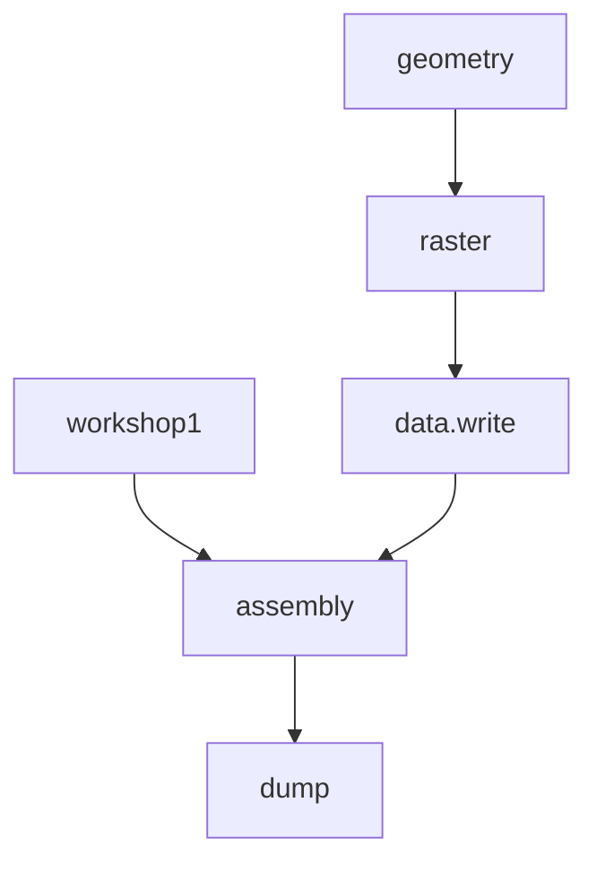

# pizza3forked #

> Maintainer:
>
> Joseph91

## Scope

<pizza3forked> is a fork of the [Pizza3](https://github.com/ovitrac/Pizza3) project for [LAMMPS](https://www.lammps.org/). This fork is intended to evolve rapidly for AI-oriented modeling.

<pizza3forked> goes beyond traditional Large Language Models (LLMs) by integrating data management within substitution rules, enabling efficient scripting of LAMMPS codes in Python. This allows users to leverage the power of LLMs to code for LAMMPS faster and more efficiently.

## Overview

Main scripts and classes are shown here. The demonstrations of implemented features are available as "workshops" (0 = draft, 1= = first workable, 2= = first production). <pizza3forked> is fully object-oriented and uses a universal container structure similar to Matlab, with self-evaluating capabilities (`param()`) or not (`pizza.private.struct()`).

### Key Features

**1. script(), do(), dolive() Methods:** These methods manage the compilation (referred to as scripting) of Python scripts into LAMMPS code, with variables created and managed at runtime in Python, LAMMPS, or both.

**2. Codelets:** The class `pizza.script()` is the main class for coding in LAMMPS using *codelets* written in Python. Codelets parse and interpret LAMMPS codes (TEMPLATES) without importing them into LAMMPS in real or deferred time, facilitating multiscale modeling.

**3. Data Management:** Input and output LAMMPS data are managed using `pizza.data()` and `pizza.dump()` objects, with extended methods to facilitate frame manipulation and conversion of outputs to inputs (equivalent to restart files).

**4. Forcefields:** Specific to each style, forcefields are managed through inheritance, allowing user libraries of forcefields to be set by overriding existing definitions. The class `pizza.generic()` is recommended for implementing user rules.

### Classes Overview

| Workshops<br> (workable demonstrations) |             **Main classes<br/>and subclasses**              |                    Low-level<br/> classes                    |
| :-------------------------------------: | :----------------------------------------------------------: | :----------------------------------------------------------: |
|          class: workshop1               |                2D drawing class: pizza.raster                |    generic struct class à la Matlab: pizza.private.struct    |
|          class: workshop2               | Advanced features: time-steps, region of interest, salting selection |                           as above                           |
|            script: geometry             |      class to read/write input files: pizza.data3.data       | self-evaluable struct with scripting/alias features: pizza.private.param |
|            script: assembly             |         class to manage dump files: pizza.dump3.dump         |                                                              |
|                                         | advanced scripting classes: pizza.script.script, pizza.script.datascript, pizza.script.scriptobject, pizza.script.scriptobjectgroup, pizza.script.pipescript |                                                              |
|                                         | forcefield classes: pizza.forcefield.forcefield, pizza.forcefield.smd, pizza.forcefield.tlsph, pizza.forcefield.ulsph, pizza.forcefield.none, pizza.forcefield.water, pizza.forcefield.solidfood, pizza.forcefield.rigidwall |                                                              |

## Workshop1: Designing, Running, and Analyzing a LAMMPS Project

Workshop1 demonstrates the main steps to design, run, and analyze a LAMMPS project from Python 3.x, with a detailed flowchart and code snippets provided for reference.

### Flowchart



### Python Code Example

```python
# Initialization of the scheme
bead_kernel_radius = 0.0015
init = initialization(neighbor =[bead_kernel_radius,"bin"])
    
# Scriptobject handles bead interactions
FLUID = scriptdata(
        rho = 1000,
        c0 = 100.0,
        q1 = 1.0,
        contact_stiffness = 10000000
    )    
SOLID = scriptdata(
        rho = 2000,
        c0 = 200.0,
        sigma_yield = '0.1*${E}',
        contact_stiffness = 10000000
    )
WALL = scriptdata(
        rho = 3000,
        c0 = 200.0,
        contact_stiffness = 10000000,
        contact_scale = 1.5
    )
b1 = scriptobject(name="bead 1",
                  group = ["rigid", "solid"],
                  filename='./raster_2_types.lmp',
                  forcefield=rigidwall(USER=WALL))
b2 = scriptobject(name="bead 2",
                  group = ["fluid", "ulsph"],
                  filename = './raster_2_types.lmp',
                  forcefield=water(USER=FLUID))
b3 = scriptobject(name="bead 3",
                  group = ["oscillating", "solid","tlsph"],
                  filename = './raster_4_types.lmp',
                  forcefield=solidfood(USER=SOLID))
b4 = scriptobject(name="bead 4",
                  group = ["solid", "tlsph"],
                  filename = './raster_4_types.lmp',
                  forcefield=solidfood(USER=SOLID))

# Set gravity, timestep, adjusted kernel radius
inte = integration()
    
# Modify which data is returned to the terminal
thermo = thermo_print()
    
# Equilibration/relaxation protocol, iterations can be reduced or augmented
equilsteps = equilibration(it=15)
    
# Modify the dump settings, outstep, properties dumped etc.
dmp = smddump(outstep=2000,outputfile=["dump.workshop1"],)
    
# Use equations to move specific objects or groups of atoms
moves = translation(vx = ["0.1*exp(-step/100)"],
                        vy = ["0"], vz = ["0"]) & \
    run() & \
    translation() & \
    force() & \
    run()

# Combine everything into a full script and write file  
collection = b1 + b2 + b3 + b4
fullscript = init + collection.script + inte + thermo + equilsteps + dmp + moves
fullscript.write("./tmp/in.swimmingpool")
```

### Output of Workshop1

The LAMMPS script and associated videos for equilibration and run steps are generated directly from the dump files.

## Workshop2: Enhancements and New Features

Workshop2 introduces several enhancements and new features, including:

1. Inputs set from microscopic images
2. Setting time-step and salting
3. Two examples: squeeze case and shearing case

New classes and updates such as `workshop2.file` and `workshop2.group` provide additional methods for creating groups in LAMMPS, supplementing the interactions class.

### Examples

#### Squeeze Flow

A fluid block is squeezed between two surfaces, with the lower surface being "sensing" to detect stresses.

#### Shear Flow

Detailed examples and improvements are illustrated, enhancing user experience and functionality.

## pizza.raster()

Raster is a 2D space-filling model for very coarse-grained systems. The code allows easy generalization in 3D.

### Principle to Generate Input Data

Example code creates simple objects with different shapes and bead types.

```python
from pizza.raster import raster, emulsion, coreshell

# Drawing area
R = raster()
# Rectangle shapes
R.rectangle(1,24,2,20,name='rect1')
R.rectangle(60,80,50,81, name='rect2',beadtype=2,angle=40)
R.rectangle(50,50,10,10, mode="center",angle=45,beadtype=1)
# Circles and ellipses
R.circle(45,20,5,name='C1',beadtype=3)
R.circle(35,10,5,name='C2',beadtype=3) 
R.circle(15,30,10, name='p1',beadtype=4,shaperatio=0.2,angle=-30)
R.circle(12,40,8, name='p2',beadtype=4,shaperatio=0.2,angle=20)   
R.circle(12,80,22,name='p3',beadtype=4,shaperatio=1.3,angle=20)
# Other polygons
R.triangle(85,20,10,name='T1',beadtype=5,angle=20)
R.diamond(85,35,5,name='D1',beadtype=5,angle=20)
R.pentagon(50,35,5,name='P1',beadtype=5,angle=90)
R.hexagon(47,85,12,name='H1',beadtype=5,angle=90)
# Labels and first plot
R.label("rect003")
R.plot()
R.list()
R.show()
# Refresh with all labels except one
R.clear()
R.plot()
R.show(extra="label")
R.label("rect003")
R.unlabel('rect1')
# Generate and write the corresponding pizza.data() object
X = R.data()
X.write("tmp/example.lmp")

 # Scaling is available
```

## pizza.forcefield()

Forcefields are essential but complex to set up. The `pizza.forcefield()` class facilitates their design and use via libraries.

### Basic Examples

```python
from pizza.forcefield import *

w = water(beadtype=1, userid="fluid")
w.parameters.Cp = 20
print("\n"*2,w)
f = solidfood(beadtype=2, userid="elastic")
print("\n"*2,f)
r = rigidwall(beadtype=3, userid="wall")
print("\n"*2,r)
```

## pizza.script(), pizza.script.pipescript()

`pizza.script()` is the Swiss knife of <kbd>Pizza3</kbd>.

### Classes Overview

| Class                   | Description                   | Overloaded Operators and Attributes                          |
| ----------------------- | ----------------------------- | ------------------------------------------------------------ |
| `scriptdata()`          | Variable space: $s.variable$  | $s_{12}=s_1+s_2$, $s_1+=s_2$, $s_1=s_{12}-s_2$, $s.variable=value$, $s.variable=[]$, $s[0]$, $s[-1]$ |
| `scriptobject()`        | "Bead" object: $b_i$          | `name="bead name", group=["group1","group2"], filename="input_filename.lmp", forcefield=forcefield_class` <br />$C=b_1+b_2+\ldots$<br />$b_2>b_1$ |
| `scriptobjectgroup()`   | Collection of beads: $C_k$    | `select(),group(), interactions(), forcefield(), script`<br />$C=C_1+C_2$<br />$P=C_1\|C_2$ |
| `script()`              | Script object: $S_k$          | $S(...,USER=s)$<br />`do(),write()`<br />Immediate execution: $S_{12}=S(\text{context1})$ &  $S(\text{context2})$<br />Deferred execution: $S_{12}=S_1+S_2$ <br />The same with repetitions (once,twice,3 times): $S_{123}=S_1 + S_2 * 2 + S_3 * 3$ |
| `pipescript()`          | Pipescript object: $P_k$, $Q_k$ | `do(),script,clear,rename()`<br />$P=P_0\|C_0\|S_1\|S_2\|S_3$<br />$P_{12}=P_1+P_2*2$<br />$P[0:1]=Q[0:1]$<br />$Q = p[[2,0,1,1,2]]$<br />$Q.do([0,1,4,3])$<br />$P.USER[0].a=1$<br />$P.scripts[0].USER.a=10$ |

## pizza.data3.data(), pizza.dump3.dump()

The objects `data()` and `dump()` are partly compatible and can be used alone or together.

### Basic Example

```python
# Input data objects and methods
from pizza.data3 import data
# Dump objects and methods
from pizza.dump3 import dump

datafile = "../data/play_data/data.play.lmp"
X = data(datafile)
Y = dump("../data/play_data/dump.play.restartme")
t = Y.time()
step = 2000
R = data(Y,step)
R.write("../tmp/data.myfirstrestart.lmp")
```

### Conclusion

<pizza3forked> enhances the original Pizza3 toolkit by extending its Python 3.x capabilities and facilitating multiscale modeling in LAMMPS. Integrating with LLMs for faster coding and the comprehensive management of LAMMPS scripts and data make <pizza3forked> a powerful tool for researchers and engineers in computational materials science.
